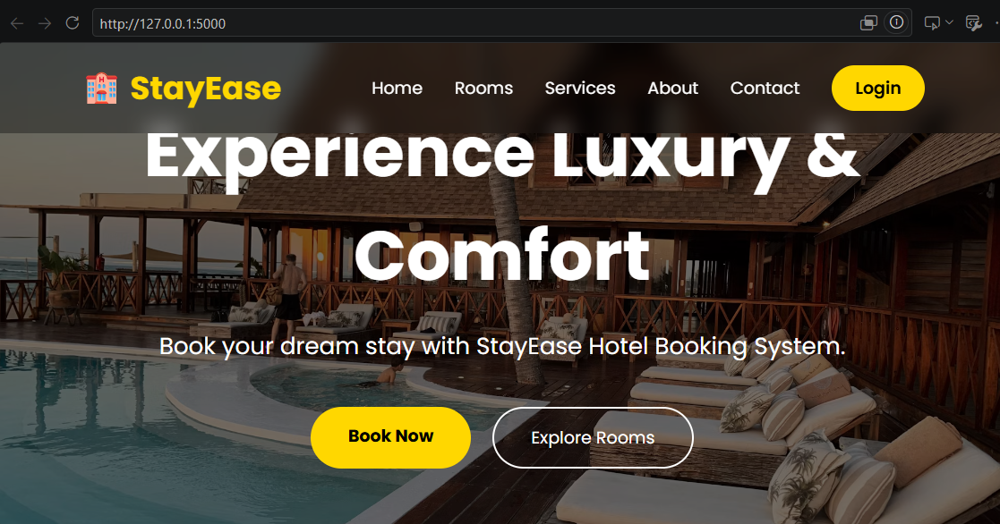
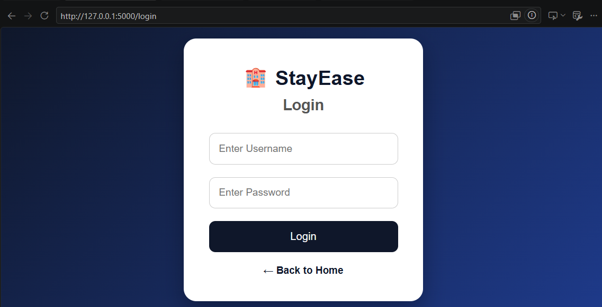
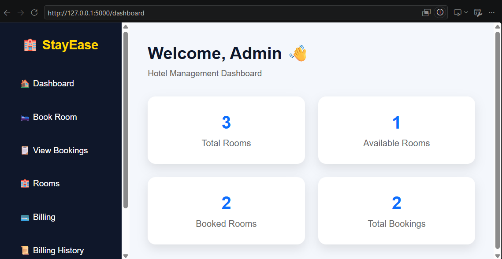
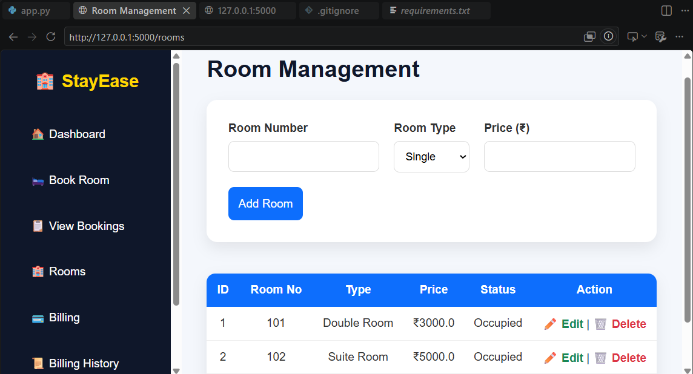
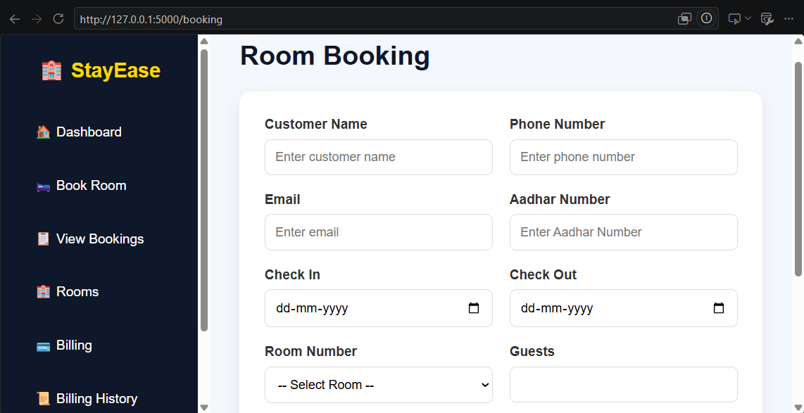
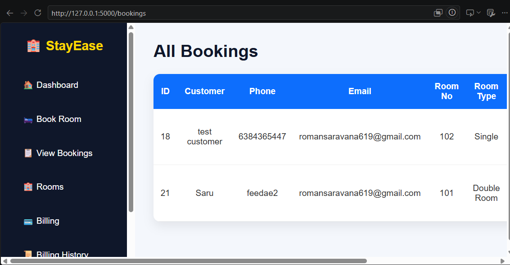
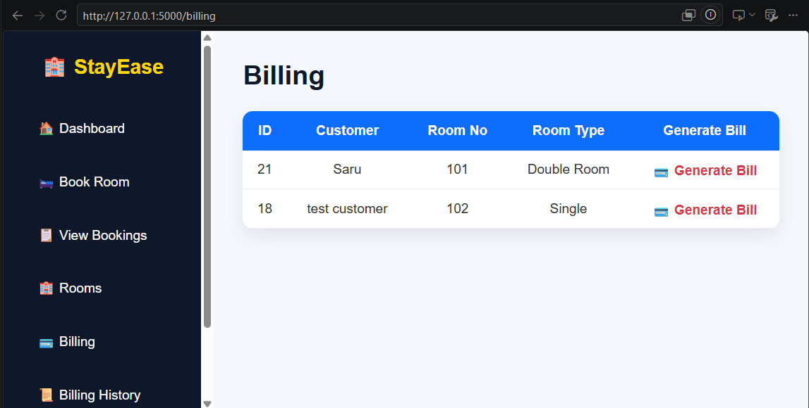
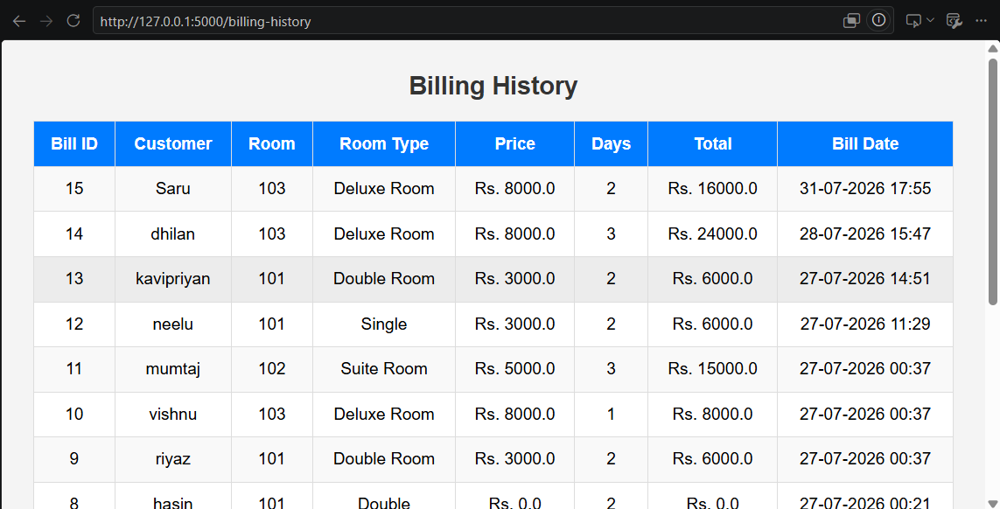

<p align="center">
  
</p>

<h1 align="center">
🏨 StayEase - Hotel Management System
</h1>

<p align="center">
A Modern Hotel Management System built using Flask, Python and SQLite.
</p>

<p align="center">


</p>

---

# 📖 About The Project

StayEase is a modern Hotel Management System developed using **Python**, **Flask**, and **SQLite**.

The application simplifies hotel operations by providing modules for room booking, room management, customer registration, billing, invoice generation, booking history, and an administrator dashboard.

This project was developed as a full-stack web application to strengthen backend development skills using Flask.

---
# ✨ Features

- 🏨 Room Management
- 🛏️ Room Booking
- 👥 Customer Registration
- 💳 Billing System
- 🧾 Invoice Generation
- 📜 Billing History
- 📊 Admin Dashboard
- 🔐 Secure Login
- ⚡ Fast and Lightweight
- 📱 Responsive User Interface
# 🛠️ Tech Stack

| Technology | Purpose |
|------------|---------|
| 🐍 Python | Backend Programming |
| 🌶 Flask | Web Framework |
| 🗄 SQLite | Database |
| 🌐 HTML5 | Frontend Structure |
| 🎨 CSS3 | Styling |
| ⚙ Git | Version Control |
| 🐙 GitHub | Project Hosting |
# 📸 Project Screenshots

## 🏠 Home Page



---

## 🔐 Login Page



---

## 📊 Dashboard



---

## 🛏️ Room Management



---

## 📅 Booking Page



---

## 📖 Booking History



---

## 💳 Billing



---

## 🧾 Billing History


# 📂 Project Structure

```
StayEase-Hotel-Management-System
│
├── bills/
├── docs/
├── screenshots/
├── static/
│   ├── css/
│   ├── images/
│   └── js/
│
├── templates/
│   ├── index.html
│   ├── login.html
│   ├── dashboard.html
│   ├── booking.html
│   ├── bookings.html
│   ├── rooms.html
│   ├── billing.html
│   ├── billing_history.html
│   └── ...
│
├── app.py
├── database.py
├── requirements.txt
├── stayease.db
└── README.md
```
# ⚙️ Installation

## Clone the Repository

```bash
git clone https://github.com/romansaravana619-lang/StayEase-Hotel-Management-System.git
```

## Move into the Project

```bash
cd StayEase-Hotel-Management-System
```

## Install Dependencies

```bash
pip install -r requirements.txt
```

## Run the Application

```bash
python app.py
```

Open your browser:

```
http://127.0.0.1:5000
```
# 📋 Modules

✔ Home Page

✔ Login System

✔ Dashboard

✔ Room Management

✔ Room Booking

✔ Billing

✔ Invoice Generation

✔ Booking History

✔ Billing History
# 🗄 Database

Database Used:

- SQLite

Main Database File:

```
stayease.db
```

The database stores:

- Customer Details

- Room Information

- Booking Records

- Billing Details

- Payment History

# 🚀 Future Improvements

- 🌐 Online Room Booking
- 💳 Payment Gateway Integration
- 📧 Email Notifications
- 📱 Mobile Responsive Dashboard
- 👤 Customer Portal
- 📊 Analytics Dashboard
- ☁ Cloud Database Support
- 🔐 Role-Based Authentication
- 📅 Check-In / Check-Out Management

# 👨‍💻 Developer

**Saravana Kumar M**

🎓 Electrical & Electronics Engineering Student

💻 Python | Flask | SQLite | HTML | CSS

📍 Coimbatore, Tamil Nadu, India

📧 romansaravana619@gmail.com

🔗 LinkedIn

https://www.linkedin.com/in/saravanakumar1225/

# ⭐ Support

If you found this project useful,

⭐ Star this repository

🍴 Fork the project

💬 Share your feedback

Every contribution and suggestion is appreciated.

# 📜 License

This project is developed for educational and portfolio purposes.

Feel free to explore, learn, and improve upon it.

---

<p align="center">

Made with ❤️ by <b>Saravana Kumar M</b>

Learning • Building • Improving 🚀

</p>